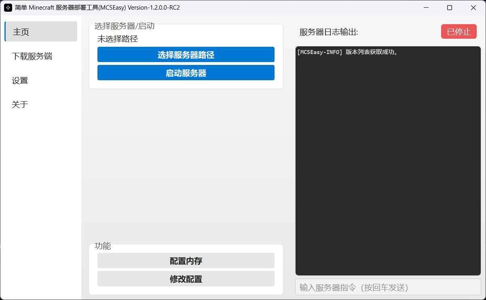
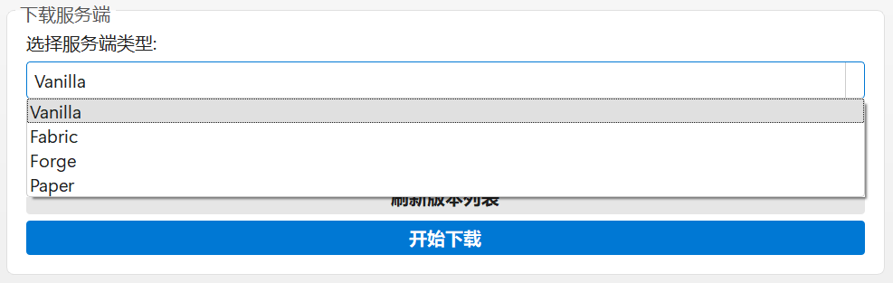
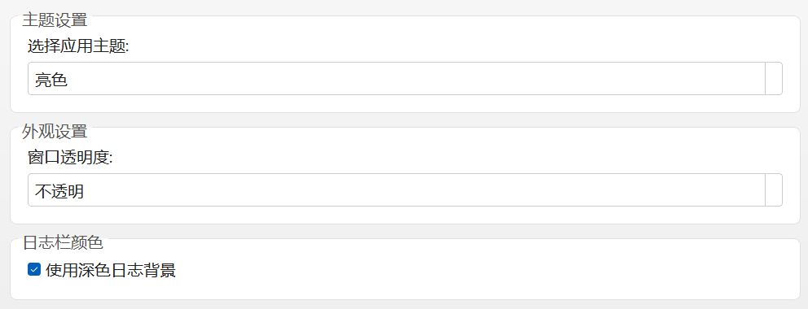

<h1 align="center">Minecraft Easy Server Launcher MCSEasy</h1>

<p align="center">
  
</p>

<div align="center">
<p align="center">
  <b><a href="../README.md">简体中文</a> | <a href="README_ZHTW.md">繁體中文</a> | <a>English</a></b>
</p>

[](https://github.com/GoldenHoe/MCSEasy)
[](https://github.com/GoldenHoe/MCSEasy/blob/main/LICENSE)

</div>

### Designed to *help users who want to create Minecraft servers to launch and monitor their servers*


## Overview

This program is a **tool for automating the deployment of Minecraft servers**, written in **Python** and packaged with **PyInstaller**.  
<br>Its purpose is to **simplify the installation and startup process so that users can more easily deploy and monitor their Minecraft servers**.

## What are the advantages of MCSEasy?

### ✨ Lightweight
Small footprint, no need to install third-party apps, click and run.  
<div align="center">
    
</div>


### ⭐ Quick Management
The UI is clear and straightforward, making server management fast and convenient.  
<div align="center">
    
</div>

### 🛠️ Version Support
MCSEasy supports downloading multiple server types. Forge servers use [BMCLAPI[↗]](https://bmclapidoc.bangbang93.com/) to provide high-speed downloads.  
<div align="center">
    
</div>

> [!NOTE]
> #### Server types supported in MCSEasy 1.2  
> - Vanilla  
> - Paper  
> - Forge  
> - Fabric  


### 🎨 Customization
Provides basic personalization options as well as an optional translucent window setting.  
<div align="center">
    
</div>

## User Guide
### System Requirements
1. A computer running a supported version of Windows/macOS/Linux  
See [Supported OS Versions(Simplified Chinese)[↗]](SUPPORTING_OS.md)

> [!WARNING]  
> Builds for Linux/macOS currently contain serious errors. Use is not recommended.  
2. Network connection.

### Recommended Hardware and Software
1. Java Development Kit (JDK) 8 or OpenJDK 8.  
2. Sufficient disk space for Minecraft server files.  
3. CPU with at least 2 cores (physical), 8 cores or more recommended.  
4. At least 2 GB of RAM (physical memory, not virtual memory or SWAP).  
5. Ethernet connection of 100 Mbps or higher.  
> [!NOTE] Using a VPN is recommended for faster server version list retrieval and downloads.  
6. FRP or other NAT traversal software (ignore if you have a public IP).  
7. Python 3.6 or higher installed.  

## Download Options
1. Clone the project directly from the GitHub repository.  
2. Download the release archive and extract it to a specified directory.  
3. Download a release version (already packaged as an executable `.exe` file).  

## Launch

After extraction, **simply run** `MCSEasy-vx.x.x.x-<release type>.exe`  
### Release Type Naming (effective from v1.2.0.0-Beta1 onwards)
- Beta (test version, unstable)  
- RC (Release Candidate)  
- GA (General Availability, stable release)  
- LTS (Long-Term Support, only one LTS release: `LTS Release-v1.0.0`, which became unavailable after November 1, 2024)  
- EP (Emergency Patch, urgent bugfix release)  
- 
```

# Version Example

MCSEasy <version>-<release type>

MCSEasy v1.2.0.0-Beta1 (Beta version)
MCSEasy v1.2.0.0-RC1 (Release Candidate)
MCSEasy v1.2.0.0-RC1-GUIRefactor (Release Candidate with description suffix)
MCSEasy v1.2.0.0-GA (Stable release)

```

## Notes

Depending on your computer performance and network conditions, some operations (download and startup) may take some time.

## * AI Content Notice

Some parts of the GUI code in this project were generated with the assistance of ChatGPT / Google Gemini, and later reviewed and modified by humans.  
AI-generated content is only used to improve development efficiency and does not guarantee complete correctness. Project maintenance and responsibility are borne by the developer.  

## Contribution & Feedback

If you find any issues or have suggestions for improvements, please email **hoe_team@outlook.com**. Contributions of all kinds are welcome, including code, documentation, and testing.  
The project’s application icon was generated by [AppIcon Force[↗]](https://zhangyu1818.github.io/appicon-forge/).  

## License
Copyright © 2024-2025 HOE Team  

This project follows the [MIT License[↗]](https://github.com/GoldenHoe/MCSEasy/blob/main/LICENSE)

> [!NOTE]
> This license means:  
> 
> 1.  **You can freely use this project’s code**, whether in personal or commercial projects.  
> 2.  **You can modify and redistribute** the code.  
> 3.  **You can even use it to develop commercial software and sell it**, as long as you include the original MIT license text and copyright notice in your product.  
> 4.  **The author provides no warranty**. If using this software causes any problems, you take full responsibility.  

> [!NOTE]  
> This English document was translated with the assistance of ChatGPT
