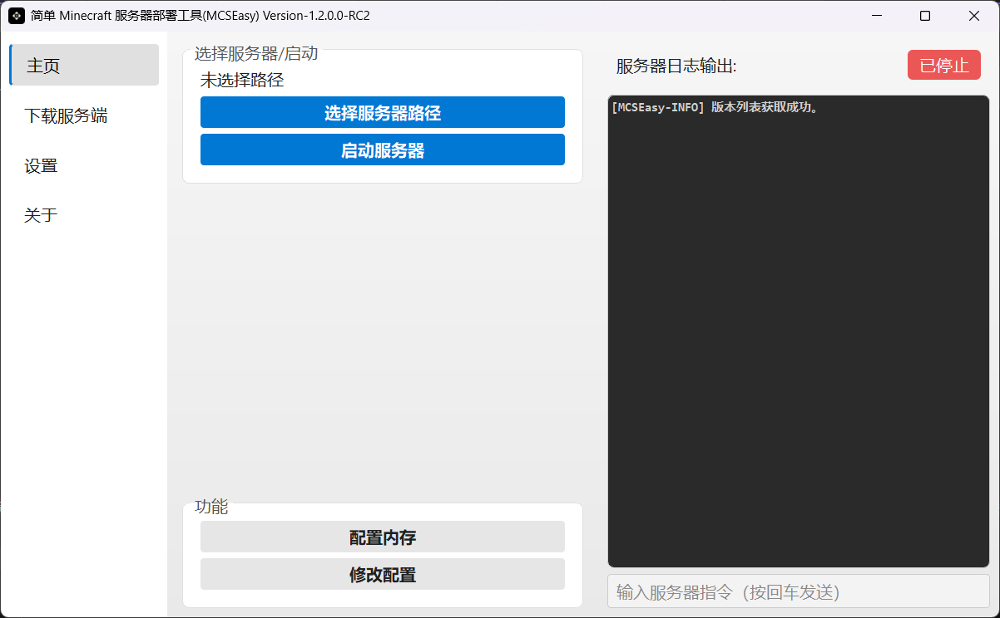

<h1 align="center">Minecraft簡易開服程式MCSEasy</h1>

<p align="center">
  
</p>

<div align="center">
<p align="center">
  <b><a href="../README.md">简体中文</a> | <a>繁體中文</a> | <a href="README_ENG.md">English</a></b>
</p>

[](https://github.com/GoldenHoe/MCSEasy)
[](https://github.com/GoldenHoe/MCSEasy/blob/main/LICENSE)

</div>

### 用於 *幫助有需要建立 Minecraft 伺服器的使用者開啟並監視他們的MC伺服器*


## 概述

本程式是一個**用於自動化部署 Minecraft 伺服器的工具**，使用 **Python** 撰寫，**PyInstaller** 封裝。  
<br>它旨在**簡化伺服器的安裝和啟動操作，讓有需要建立 Minecraft 伺服器的使用者能夠更輕鬆地部署他們的 Minecraft 伺服器並監視伺服器狀態**。

## MCSEasy有什麼優點？

### ✨ 輕量化
佔用小，無需安裝第三方應用，點擊即用。  
<div align="center">
    
</div>


### ⭐ 快捷管理
UI介面一目了然，伺服器管理方便快捷  
<div align="center">
    
</div>

### 🛠️ 版本支援
MCSEasy擁有多個伺服端的下載支援，Forge端使用 [BMCLAPI[↗]](https://bmclapidoc.bangbang93.com/) 提供的高速下載支援。  
<div align="center">
    
</div>

> [!NOTE]
> #### MCSEasy 1.2支援下載的伺服端  
> - Vanilla  
> - Paper  
> - Forge  
> - Fabric  


### 🎨 個性化
提供基礎的個性化以及可選的半透明視窗選項。  
<div align="center">
    
</div>

## 使用指南
### 程式硬性要求
1. 電腦執行受支援的Windows/macOS/Linux版本  
在此查看[支援的系統版本(簡體中文)[↗]](./docs/SUPPORTING_OS.md)

> [!WARNING]  
> 對Linux/macOS平台的建構有嚴重錯誤，暫時不建議使用。  
2. 網路連線。

### 建議擁有的軟硬體環境
1. Java Development Kit(Java JDK) 8或OpenJDK 8。  
2. 足夠的磁碟空間用於Minecraft伺服器檔案。  
3. CPU建議2核心（實體核心）及以上，8核心以上最佳。  
4. 擁有至少2GB RAM（實體記憶體，非虛擬記憶體或SWAP分割區）。  
5. 使用100Mbps和以上的乙太網路連線  
> [!NOTE]建議使用VPN以更快速地獲取伺服器版本清單和下載伺服器。  
6. 使用frp等內網穿透軟體（公網IP可忽略）。  
7. 下載Python3.6以上版本。  

## 下載方式
1. 直接從GitHub倉庫clone本專案。  
2. 下載發布的壓縮檔並解壓縮到指定目錄。  
3. 下載Release的發布版本(已打包成exe可執行檔)。  

## 啟動

解壓縮後**直接**執行 `MCSEasy-vx.x.x.x-<發行類型>.exe`  
### 發行版本號說明（v1.2.0.0-Beta1以後開始施行）
- Beta(測試版，不穩定)  
- RC(Release Candidate，發布候選版)  
- GA(General Availability，正式版)  
- LTS(延長支援版本，只有一個發行的LTS版本：`LTS Release-v1.0.0`，此版本已在2024年11月1日後不可用)  
- EP(Emergency Patch，緊急修復版本)  
- 
```

# 版本號示例

MCSEasy <版本號>-<發行類型>

MCSEasy v1.2.0.0-Beta1 (測試版)
MCSEasy v1.2.0.0-RC1 (發布候選)
MCSEasy v1.2.0.0-RC1-GUIRefactor (帶有說明後綴的發布候選)
MCSEasy v1.2.0.0-GA (正式版)

```

## 注意事項

根據你的電腦效能和網路狀況，某些操作（下載與啟動）可能需要一些時間。  

## * AI 內容生成提示

本專案部分 GUI 程式碼由 ChatGPT / Google Gemini 輔助生成，後續已由人工審查和修改。  
AI 生成的內容僅用於提高開發效率，不保證完全正確性。專案維護與責任由開發者承擔。  

## 貢獻與回饋

如果你發現任何問題或有改進建議，請發送郵件到**hoe_team@outlook.com**。也歡迎任何形式的貢獻，包括程式碼、文件和測試。  
本專案應用圖示生成自[AppIcon Force[↗]](https://zhangyu1818.github.io/appicon-forge/)  

## 授權條款
Copyright © 2024-2025 HOE Team  

專案遵循[MIT授權條款[↗]](https://github.com/GoldenHoe/MCSEasy/blob/main/LICENSE)

> [!NOTE]
> 這份授權條款意味著：
> 
> 1.  **你可以隨意使用這個專案程式碼**，無論是在個人專案還是商業專案中。  
> 2.  **你可以修改並重新發布**這個程式碼。  
> 3.  **你甚至可以用它來開發商業軟體並銷售**，只要你在你的產品中包含原始的 MIT 授權條款文本和版權聲明。  
> 4.  **作者不提供任何保證**，如果使用該軟體導致任何問題，你需要自己承擔風險。  

> [!NOTE]  
> 本繁體中文文件由 ChatGPT 協助翻譯
